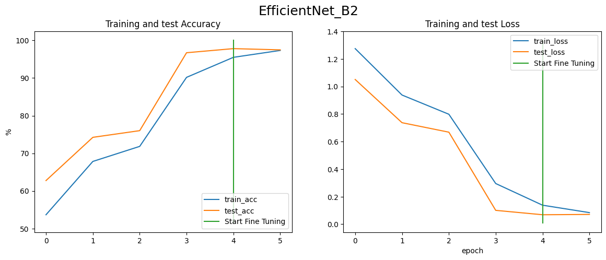
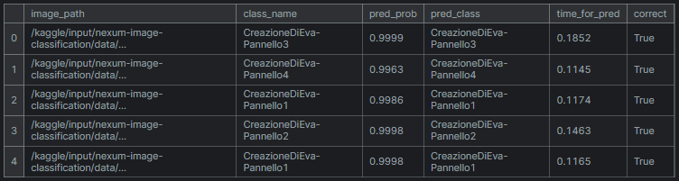

# Art Work Classification Model
#### art-work-classification.ipynb

This file contains code for classifying artwork images using a convolutional neural network (CNN). The primary model used is EfficientNet_B2 with transfer learning for feature extraction.

## Installation

Before running the code, install the necessary dependencies:

```bash
pip install torchinfo
pip install tqdm
pip install wget
```
## Usage
### Imports
The script starts with importing necessary libraries:

- torch and torchvision for deep learning.
- pandas, numpy, matplotlib, and PIL for data handling and visualization.
- tqdm for progress bars.
- pathlib and os for file handling.
- wget and tarfile for downloading and extracting data.
### Configuration
A dictionary named FLAGS is used to set up various parameters such as:

- datadir: Directory containing the dataset.
- batch_size: Batch size for training.
- num_workers: Number of workers for data loading.
- num_epochs: Number of epochs to train the model.
- show_results_every_X_batch: Interval to show training results.
- IMAGE_SIZE: Size to which images are resized.
### Device Setup
The script checks for GPU availability and sets the device accordingly:
```bash
device = "cuda" if torch.cuda.is_available() else "cpu"
```
### Data Preparation
The script reads the dataset and counts the number of images in each directory. It uses ImageFolder from torchvision.datasets to handle the data and applies transformations using transforms.Compose.
#### ImageFolder structure
- nexum-image-classification
    - data
      - ##### train
        - BasilicaDiSanPietro
        - CreazioneDiAdamo-Pannello1
        - CreazioneDiAdamo-Pannello2
        - CreazioneDiAdamo-Pannello3
        - CreazioneDiAdamo-Pannello4
        - CreazioneDiEva-Pannello1
        - CreazioneDiEva-Pannello2
        - CreazioneDiEva-Pannello3
        - CreazioneDiEva-Pannello4
      - ##### test
        - BasilicaDiSanPietro
        - CreazioneDiAdamo-Pannello1
        - CreazioneDiAdamo-Pannello2
        - CreazioneDiAdamo-Pannello3
        - CreazioneDiAdamo-Pannello4
        - CreazioneDiEva-Pannello1
        - CreazioneDiEva-Pannello2
        - CreazioneDiEva-Pannello3
        - CreazioneDiEva-Pannello4

### Data Augmentation and Visualization
Data augmentation is applied using transforms.TrivialAugmentWide. Sample images before and after transformation are displayed using matplotlib.

### Model Setup
The core of the script involves setting up the EfficientNet_B2 model:

- Pretrained weights are loaded.
- The classifier head is modified to match the number of classes in the dataset.
- A summary of the model architecture is printed using torchinfo.
### Training and Evaluation
Data loaders for training and testing datasets are created, and the training loop processes the data in batches, updating the model's weights. The results are periodically displayed based on the show_results_every_X_batch parameter.

### Output Directories
Directories for storing results and models are created if they do not exist:
```bash
Path('/kaggle/working/results').mkdir(parents=True, exist_ok=True)
Path('/kaggle/working/models').mkdir(parents=True, exist_ok=True)
```
## Accuracy

## Test Result


### Note:
- for Modeling part, the kaggle with GPU P100 as accelerator is used.
- in this jupyter notebook TinyVGG, EfficientNet-B2 and EfficientNet-B2 tunied models are created. 
  - Models files from this notebook:
    - #### **EfficientNet_B2_FT.pth** (used for this project)
    - EfficientNet_B2_FT_20_Percent.pth
    - TinyVGG.pth

# Artwork Classification App - Gradio
#### app.py

This file contains a Gradio web application for classifying artwork images using an EfficientNet_B2 model. The model utilizes transfer learning and can predict the class of an artwork image from a predefined set of classes.

## Installation

Before running the app, install the necessary dependencies:

```bash
pip install gradio
pip install torch
pip install torchvision
```
## Usage
### Imports
The script starts with importing necessary libraries:
- gradio for creating the web interface.
- torch and torchvision for deep learning.
- os for file handling.
- timeit for measuring prediction time.
- typing for type annotations.
### Model Function
The function create_effnetb2_model initializes an EfficientNet_B2 model with the following features:

- Parameters:
  - num_classes (int): Number of classes in the classifier head.
  - seed (int): Random seed value for reproducibility.
  - is_TrivialAugmentWide (bool): Whether to apply data augmentation.
  - freeze_layers (bool): Whether to freeze the pretrained layers.
- Returns:
  - effnetb2_model (torch.nn.Module): The EfficientNet_B2 model.
  - effnetb2_transforms (torchvision.transforms): The image transformations for the model.
### Setup Class Names
The class_names list contains the names of the artwork classes:
- BasilicaDiSanPietro
- CreazioneDiAdamo-Pannello1
- CreazioneDiAdamo-Pannello2
- CreazioneDiAdamo-Pannello3
- CreazioneDiAdamo-Pannello4
- CreazioneDiEva-Pannello1
- CreazioneDiEva-Pannello2
- CreazioneDiEva-Pannello3
- CreazioneDiEva-Pannello4
### Model and Transforms Preparation
1. Create the EfficientNet_B2 model with create_effnetb2_model.
2. Load the saved model weights from EfficientNet_B2_FT.pth.
### Create Prediction Function
The prediction function takes an image and returns the predicted class label along with the prediction time:

- Parameters:
  - img (PIL Image): The input image for prediction.
- Returns:
  - pred_labels_and_probs (dict): A dictionary of class labels and their corresponding probabilities.
  - pred_time (float): The time taken to make the prediction.
## Gradio App
1. App Details:
- title: The title of the app.
- description: A brief description of the app.
- article: Additional information about the app.
2. Examples:
- Load examples from the examples/ directory.
3. Gradio Interface:
- Create a Gradio interface with the prediction function.
- Define the input as an image and output as a label and prediction time.
- Include example images for testing.
4. Launch:
- Launch the Gradio app with demo.launch().
## Running the App
To run the app, execute the app.py script. This will start a local server and open the Gradio interface in your default web browser.

```bash
python app.py
```

# EfficientNet_B2 Model Script and Optimization
#### TorchScript.py

This script contains code to create, load, and optimize an EfficientNet_B2 model for mobile deployment using PyTorch. The script includes model creation with transfer learning, saving the model in TorchScript format, and optimizing it for mobile inference. Additionally, the saved `.pt` model is designed for serving it in Vertex AI and API deployment.

## Installation
Before running the script, install the necessary dependencies:

```bash
pip install torch
pip install torchvision
```
## Usage
### Imports
The script starts with importing necessary libraries:
- torch and torchvision for deep learning.
- torch.utils.mobile_optimizer for optimizing the model for mobile deployment.
### Model Function
The function create_effnetb2_model initializes an EfficientNet_B2 model with the following features:
- Parameters:
  - num_classes (int): Number of classes in the classifier head.
  - seed (int): Random seed value for reproducibility.
  - is_TrivialAugmentWide (bool): Whether to apply data augmentation.
  - freeze_layers (bool): Whether to freeze the pretrained layers.
- Returns:
  - effnetb2_model (torch.nn.Module): The EfficientNet_B2 model.
  - effnetb2_transforms (torchvision.transforms): The image transformations for the model.
### Load Trained Model
The script proceeds to load the trained model weights from EfficientNet_B2_FT.pth and sets the model to evaluation mode:

```bash
EfficientNetB2_model, EfficientNetB2_transforms = create_effnetb2_model(num_classes=9, is_TrivialAugmentWide=False)
EfficientNetB2_model.load_state_dict(
    torch.load(
        f="EfficientNet_B2_FT.pth",
        map_location=torch.device("cpu"),  # Load to CPU for compatibility
    )
)
EfficientNetB2_model.eval()
```
### Convert to TorchScript
The model is then converted to TorchScript format to make it suitable for deployment:

```bash
scripted_model = torch.jit.script(EfficientNetB2_model)
scripted_model.save('model_scripted.pt')
```
### Optimize for Mobile
The scripted model is further optimized for mobile deployment using optimize_for_mobile, and saved in the Lite Interpreter format:
```bash
scripted_module = torch.jit.script(EfficientNetB2_model)
optimized_scripted_module = optimize_for_mobile(scripted_module)
optimized_scripted_module._save_for_lite_interpreter("my_model_lite.ptl")
```
### Models files
- model_scripted.pt (for API integration)
- my_model_lite.ptl (for mobile integration)

## Performance Note
Using the optimized Lite Interpreter model results in about 60% faster inference compared to the non-optimized Lite Interpreter model, and about 6% faster than the non-optimized full JIT model.

## Vertex AI and API Integration
The saved model_scripted.pt model is intended for deployment on Vertex AI, allowing seamless integration with various APIs. This facilitates robust model serving and scalability, making it suitable for production environments.

# Model Test locally
## Load the Model
The script loads the TorchScript model from model_scripted.pt:
```bash
model_scripted = torch.load('model_scripted.pt', map_location=torch.device('cpu'))  # Use 'cuda' if available for GPU inference
#model_scripted.eval()  # Set the model to evaluation mode
```
## Define Transformations
The script defines the transformations to be applied to the images before inference:
```bash
transform = transforms.Compose([
    transforms.Resize((224, 224)),  # Resize to match model's expected input size
    transforms.ToTensor(),  # Convert PIL image to tensor
    transforms.Normalize(mean=[0.485, 0.456, 0.406], std=[0.229, 0.224, 0.225]),  # Normalize if needed
])
```
## Perform Inference
The script iterates over the test images, applies the transformations, and performs inference using the TorchScript model. It then prints the predicted and actual class labels for comparison:
```bash
for label in class_labels:
    jpg_files = glob.glob(os.path.join(f'test_images\{label}', '*.JPG'))
    for pic in jpg_files:
        image = Image.open(pic)
        input_tensor = transform(image).unsqueeze(0)  # Add batch dimension

        # Perform inference
        with torch.no_grad():
            output = model_scripted(input_tensor)
            _, predicted = torch.max(output, 1)

        # Map predicted index to class label
        predicted_label = predicted.item()
        predicted_class = class_labels[predicted_label]
        print(f'Predicted Class: {predicted_class}', f'Actual Class: {label}')
```


# Serving the Model
### Description
This project utilizes TorchServe to deploy a PyTorch model as a REST API for inference. TorchServe provides an easy and flexible way to deploy models for both testing and production use cases.

### Prerequisites
Before serving the model, ensure you have the following components installed:
- TorchServe: Follow the installation instructions from the official TorchServe repository.
- curl: For testing the API endpoint using HTTP requests.

## Steps to Serve the Model
1. Model Archival:
Use torch-model-archiver to package the model along with necessary files into a .mar file.
```bash
torch-model-archiver --model-name model --version 1.0 --serialized-file models/model_scripted.pt --extra-files index_to_name.json --handler image_classifier
```
The command torch-model-archiver is used to package and prepare a PyTorch model for serving in an inference environment. In this instance:
- Model Name: model
- Version: 1.0
- Serialized File: models/model_scripted.pt
- Extra Files: index_to_name.json
- Handler: image_classifier (a predefined handler from PyTorch)
2. Start TorchServe:
Start TorchServe with the packaged model. Adjust model_store to your desired directory.
```bash
torchserve --start --model-store model_store --models served_model=model.mar
```
3. Testing the Deployment
To verify that the model is deployed correctly and is making predictions, you can use curl or any HTTP client.

4. Example using curl (Windows)
Assuming TorchServe is running locally on port 8080, you can send an image file (IMG_5150.JPG in this example) for prediction using curl:

```bash
curl.exe http://127.0.0.1:8080/predictions/model -T test_images/BasilicaDiSanPietro/IMG_5150.JPG
```

5. JSON Mapping
The index_to_name.json file maps class indices to their corresponding names. This is essential for interpreting the model's output predictions.
```bash
{
    "0": "BasilicaDiSanPietro",
    "1": "CreazioneDiAdamo-Pannello1",
    "2": "CreazioneDiAdamo-Pannello2",  
    "3": "CreazioneDiAdamo-Pannello3",
    "4": "CreazioneDiAdamo-Pannello4",
    "5": "CreazioneDiEva-Pannello1",
    "6": "CreazioneDiEva-Pannello2",
    "7": "CreazioneDiEva-Pannello3",
    "8": "CreazioneDiEva-Pannello4"
}
```
## Additional Notes
- Ensure TorchServe is running and the model is loaded (torchserve --list can be used to verify models).
Adjust file paths and commands as per your specific setup and environment.
- you can check the model after starting the torchserving too:
  ```bash
  curl.exe http://127.0.0.1:8081/models/
  ```

# Deploying PyTorch Model on Google Cloud Platform (GCP) Using Docker

This provides a Docker-based solution for deploying a PyTorch model on Google Cloud Platform (GCP) using TorchServe.

## Prerequisites
Before proceeding, ensure you have the following installed:
- Docker: Install Docker
- PyTorch model packaged as a MAR file (model.mar)
- config.properties file for TorchServe configuration
  ```bash
  inference_address=http://0.0.0.0:8080
  management_address=http://0.0.0.0:8081
  ```

## Docker description
This Dockerfile is designed to facilitate the deployment of a PyTorch model using TorchServe on Google Cloud Platform (GCP). It sets up a Docker container environment with all necessary dependencies and configurations for serving machine learning models.
#### Components:
- Base Image: Uses the official PyTorch TorchServe base image (pytorch/torchserve:latest) as the starting point. This ensures compatibility with PyTorch and TorchServe.
- Model Store Setup: Creates a directory (/home/model-server/model-store/) within the container to serve as the model repository.
- Model Deployment: Copies the model archive file (model_store/model.mar) into the model store directory (/home/model-server/model-store/). This file contains the serialized PyTorch model ready for deployment.
- Custom Configuration: Copies a custom configuration file (config.properties) into the container (/home/model-server/config.properties). This file allows for fine-tuning TorchServe settings such as logging levels and model-specific configurations.
- Environment Variables: Sets environment variables (MODEL_STORE and TS_CONFIG_FILE) to define the paths to the model store directory (/home/model-server/model-store/) and the TorchServe configuration file (/home/model-server/config.properties). These variables ensure TorchServe uses the correct configurations during operation.
- Ports Exposed: Exposes default ports (8080 and 8081) that TorchServe uses for handling HTTP and management requests. This allows external services to interact with TorchServe for inference and management purposes.
- Entry Point: Defines the entry point (CMD ["torchserve", "--start", "--model-store", "/home/model-server/model-store", "--models", "model=model.mar"]) for the container. Upon startup, it instructs TorchServe to begin serving the model (model.mar) located in the model store directory (/home/model-server/model-store/).
## Docker Setup 
1. Build Docker Image: Build the Docker image using the provided Dockerfile.
  ```bash
  docker build -t pytorch-torchserve-local .
  ```
2. Run Docker Container: Start a Docker container based on the built image. Replace <path_to_model.mar> and <path_to_config.properties> with your actual paths.

  ```bash
docker run -d -p 8080:8080 -p 8081:8081 --name pytorch-torchserve-local
docker run --name pytorch-torchserve-local -d -p 8000:8000 pytorch-torchserve-local

```
3. Accessing TorchServe: Once the container is running, TorchServe will be accessible at http://localhost:8080 for inference and http://localhost:8081 for management.

## Tagging and Pushing Docker Image to GCP Container Registry
Once you have built your Docker image locally and it's running successfully, you can tag it and push it to Google Cloud Platform (GCP) Container Registry for deployment.

1. Tag your Docker Image:
Replace your-project-id with your actual GCP project ID and your-image-name with the desired name for your Docker image.

```bash
docker tag pytorch-torchserve-local gcr.io/your-project-id/your-image-name:latest
```
This command tags your local Docker image (pytorch-torchserve-local) with the GCP Container Registry URL (gcr.io/your-project-id/your-image-name) and latest as the version tag.

2. Pushing Docker Image
Push the Docker Image to GCP Container Registry:

```bash
docker push gcr.io/your-project-id/your-image-name:latest
```
This command pushes the tagged Docker image to your GCP Container Registry under the specified project ID and image name. Ensure you have proper authentication and permissions to push images to GCP Container Registry.

3. Deploy the Docker Image on Google Cloud Platform:
- You can now deploy your Docker image on GCP Compute Engine, Google Kubernetes Engine (GKE), Cloud Run, or any other service that supports Docker containers.
- Refer to the GCP documentation or specific service documentation for instructions on deploying Docker images from Container Registry.
```bash
gcloud run deploy torch-model --image=gcr.io/your-project-id/ --allow-unauthenticated --port=8080 --min-instances=1 --memory=2Gi --no-use-http2 --platform=managed --region=europe-west4 --project=your-project-id
```
